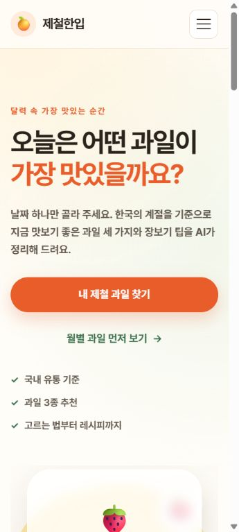
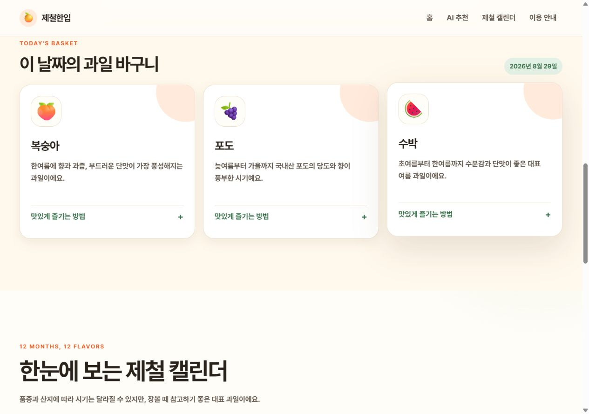

# 제철한입

날짜를 입력하면 한국에서 쉽게 구할 수 있는 제철 과일 3종과 제철 이유, 맛·영양 특징, 잘 고르는 법, 보관법, 간단한 레시피를 알려 주는 반응형 AI 웹 서비스입니다.

월별 제철 후보는 서버의 고정 데이터에서 먼저 선택합니다. AI는 정해진 과일만 설명하므로 계절과 무관한 과일을 임의로 추천할 가능성을 줄였습니다.

## 배포 URL

https://a13-sage.vercel.app/

## 주요 기능

- 날짜 기반 제철 과일 3종 추천
- Codyssey OpenAI 호환 API를 활용한 실용 정보 생성
- AI 응답 JSON 검증 및 한 번의 자동 교정
- AI 응답 형식 실패 시 기본 제철 정보 제공
- 빈 입력, API 오류, 응답 지연 안내
- 홈, AI 추천, 제철 캘린더, 이용 안내 메뉴 이동
- 모바일·태블릿·데스크톱 반응형 화면
- 키보드 탐색과 상태 메시지 읽기 보조 지원

## 화면 구성

1. **홈**: 서비스 소개와 AI 추천 바로가기
2. **AI 추천**: 날짜 입력, 로딩 상태, 과일 3종 결과 카드
3. **제철 캘린더**: 1월부터 12월까지 대표 과일 확인
4. **이용 안내**: 추천 기준, AI 정보 주의사항, 오류 대응 FAQ

## 제출 증빙

### 서비스 화면 — 데스크톱


### 서비스 화면 — 모바일



### 추천 기능 동작 화면



> 보안상 다른 프로젝트의 API 키를 재사용하지 않고, 캡처 전용 로컬 서버가 같은 월별 후보 데이터와 응답 구조를 반환하도록 구성해 결과 UI를 재현했습니다. 실제 배포 환경에서는 `api/recommend.py`가 서버 환경변수의 키로 AI API를 호출합니다.

### AI 코딩 도구 사용 과정


이 이미지는 실제 작업 대화의 핵심 요청과 구현·검증 과정을 선별해 시각화한 요약본입니다. 전체 텍스트 기록은 [AI 코딩 대화 로그](docs/ai-coding-log.md)에서 확인할 수 있습니다.

## 기술 스택

- 프론트엔드: HTML5, CSS3, JavaScript
- 백엔드: Python 3.10+, Vercel Serverless Functions
- AI: Codyssey OpenAI 호환 Chat Completions API, `gpt-5.4-mini`
- HTTP 클라이언트: `requests`
- 배포: GitHub, Vercel

## 폴더 구조

```text
A1-3/
├── api/
│   ├── __init__.py
│   ├── recommend.py
│   └── seasonal_data.py
├── css/
│   └── style.css
├── docs/
│   ├── ai-coding-log.md
│   ├── ai-coding-process.html
│   └── service-plan.md
├── images/
│   └── evidence/
│       ├── ai-coding-process.png
│       ├── ai-result.png
│       ├── desktop.png
│       └── mobile.png
├── js/
│   └── app.js
├── scripts/
│   └── evidence_server.py
├── .env.example
├── .gitignore
├── index.html
├── README.md
├── requirements.txt
├── subject.md
└── vercel.json
```

## 로컬 실행

### 1. 요구 환경

- Python 3.10 이상
- Node.js와 npm 또는 npx
- Codyssey API 콘솔에서 발급한 virtual key
- Vercel CLI(`npx`로 실행 가능)

### 2. Python 패키지 설치

`A1-3` 폴더에서 실행합니다.

```bash
python -m pip install -r requirements.txt
```

### 3. 환경변수 설정

`.env.example`을 참고해 실제 키를 현재 터미널 환경변수로 설정합니다.

Windows PowerShell:

```powershell
$env:COPA_API_KEY="YOUR_CODYSSEY_VIRTUAL_KEY"
```

macOS/Linux:

```bash
export COPA_API_KEY="YOUR_CODYSSEY_VIRTUAL_KEY"
```

실제 키를 `.env.example`, 소스 코드, README, 스크린샷에 입력하지 마세요.

### 4. Vercel 개발 서버 실행

```bash
npx vercel dev
```

터미널에 표시되는 로컬 URL을 브라우저에서 엽니다. 일반 정적 파일 서버만 사용하면 `/api/recommend` Python 함수가 실행되지 않으므로 Vercel 개발 서버를 사용해야 합니다.

## 요청 흐름

1. 사용자가 날짜를 선택하고 추천 버튼을 누릅니다.
2. JavaScript가 `POST /api/recommend`로 날짜 JSON을 전송합니다.
3. Python 함수가 날짜 형식을 검증하고 해당 월의 과일 후보 3종을 선택합니다.
4. 서버가 `COPA_API_KEY`로 AI API를 호출합니다.
5. AI 응답이 필수 JSON 구조인지 확인하고, 형식이 잘못되면 한 번 교정합니다.
6. 브라우저가 응답을 안전한 DOM 요소로 만들어 화면에 표시합니다.

요청 예시:

```json
{
  "date": "2026-08-29"
}
```

## 실패 처리

- 빈 날짜: API를 호출하지 않고 날짜 선택 안내
- 잘못된 날짜: `400` 응답과 입력 확인 안내
- 키 미설정: `500` 응답과 서비스 설정 안내
- AI 인증·쿼터·네트워크 오류: `502` 응답과 재시도 안내
- AI JSON 형식 오류: 한 번 교정 후에도 실패하면 기본 제철 정보 표시
- 20초 이상 지연: 브라우저가 요청을 중단하고 재시도 안내

## Vercel 배포

1. 이 `A1-3` 독립 Git 저장소를 새 GitHub 저장소에 push합니다.
2. Vercel 대시보드에서 **Add New Project**를 선택하고 GitHub 저장소를 연결합니다.
3. Framework Preset은 **Other**, Root Directory는 저장소 루트를 사용합니다.
4. Project Settings → Environment Variables에 다음 값을 추가합니다.
   - Name: `COPA_API_KEY`
   - Value: 실제 Codyssey virtual key
5. Deploy를 실행합니다.
6. 배포 URL에서 메뉴, 반응형 화면, AI 추천을 확인합니다.
7. 정상 동작을 확인한 뒤 이 README의 배포 URL을 실제 주소로 변경합니다.

## 수동 확인 목록

- 날짜 입력 후 과일 카드가 정확히 3개 표시되는지
- 각 카드에서 맛·영양, 고르는 법, 보관법, 레시피를 펼칠 수 있는지
- 빈 입력, 서버 오류, 타임아웃 메시지가 이해하기 쉬운지
- 메뉴가 네 섹션으로 이동하는지
- 360px, 768px, 1280px 화면에서 레이아웃이 깨지지 않는지
- Tab 키로 메뉴, 날짜, 버튼, 결과 세부 정보를 조작할 수 있는지
- 브라우저 소스와 Git 파일에 실제 API 키가 없는지

## 보안 주의 사항

- API 키는 반드시 서버 환경변수 `COPA_API_KEY`로 관리합니다.
- 브라우저 JavaScript에서 AI API를 직접 호출하지 않습니다.
- `.env`와 `.vercel` 폴더는 Git에 포함하지 않습니다.
- 키 노출이 의심되면 즉시 폐기하고 새 키를 발급받습니다.
- AI API에는 사용량과 과금이 발생할 수 있으므로 요청 중 버튼을 비활성화합니다.

## 정보 이용 안내

제철 시기는 품종, 산지, 하우스 재배와 기후에 따라 달라질 수 있습니다. AI가 제공하는 영양 정보는 일반적인 참고용이며 질병의 진단이나 치료를 위한 의료 조언이 아닙니다.
