# Make와 n8n을 활용한 지원자 점수 분류 자동화

Google Sheets의 지원자 점수를 확인하고 합격·불합격·오류로 분류한 뒤, 결과 시트에 기록하고 Discord로 알리는 자동화 프로젝트입니다.

- **프로젝트 1:** 동일한 워크플로우를 Make와 n8n으로 각각 구현하고 비교
- **프로젝트 2:** n8n 워크플로우를 15분마다 자동 실행하도록 확장
- **합격 기준:** 50점 이상
- **불합격 기준:** 50점 미만
- **오류 기준:** 점수가 비어 있거나 정상적으로 판정할 수 없는 경우

## 자동화 핵심 개념

### Trigger

워크플로우를 시작하는 이벤트입니다. 프로젝트 1에서는 Make의 예약 실행과 n8n의 수동 실행 Trigger로 같은 데이터 흐름을 시험했습니다. 프로젝트 2에서는 n8n의 `Schedule Trigger`를 사용해 15분마다 자동 실행되도록 구성했습니다.

### Action

Trigger 이후 실제 업무를 수행하는 단계입니다. 이 프로젝트에서는 Google Sheets 행 조회, 결과 시트 기록, Discord 메시지 전송이 Action에 해당합니다.

### 조건 분기

입력값에 따라 서로 다른 작업 경로를 선택하는 단계입니다. Make에서는 Router와 Filter를, n8n에서는 Switch를 사용했습니다.

| 분기 | 조건 | 처리 |
| --- | --- | --- |
| 합격 | 점수 ≥ 50 | 합격 시트 기록 후 Discord 합격 알림 |
| 불합격 | 점수 < 50 | 불합격 시트 기록 후 Discord 불합격 알림 |
| 오류 | 점수가 없거나 판정 불가 | Discord 오류 알림 |

---

## 프로젝트 1 — Make와 n8n 비교 구현

### 공통 자동화 흐름

```text
Trigger
  → Google Sheets 지원자 행 조회
  → 점수 기준 조건 분기
      ├─ 오류   → Discord 오류 알림
      ├─ 합격   → 합격 시트에 행 추가 → Discord 합격 알림
      └─ 불합격 → 불합격 시트에 행 추가 → Discord 불합격 알림
```

두 도구 모두 Trigger 1개 이상, 조건 분기 1개, Google Sheets와 Discord를 이용한 Action 2개 이상으로 같은 업무 흐름을 구현했습니다.

### Make 구현

1. Google Sheets `Search Rows`가 지원자 행을 조회합니다.
2. `If-else` Router가 오류·합격·불합격 경로로 나눕니다.
3. 합격과 불합격 데이터는 각각의 Google Sheets에 `Add a Row`로 기록합니다.
4. 각 경로의 처리 결과를 Discord `Send a Message`로 전송합니다.

#### 워크플로우와 실행 상태

아래 화면에서 세 경로가 각각 1회 실행되었고 Google Sheets 및 Discord 모듈이 정상 완료된 것을 확인할 수 있습니다.

.png>)

#### Google Sheets 실행 결과

| 조회한 원본 데이터 | 합격 시트 | 불합격 시트 |
| --- | --- | --- |
| 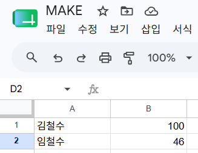 | 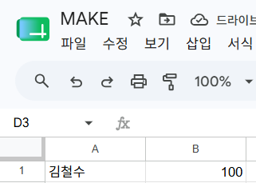 | 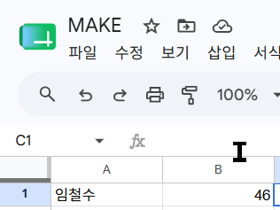 |

- 김철수 100점은 합격 시트로 이동했습니다.
- 임철수 46점은 불합격 시트로 이동했습니다.

#### Discord 실행 결과

합격 메시지와 오류 메시지가 Discord 채널에 전달된 것을 확인했습니다. 불합격 경로는 워크플로우 실행 완료 표시와 불합격 시트 기록으로 정상 동작을 확인했습니다.

![Make Discord 알림 결과]


### n8n 구현

1. `Manual Trigger`로 비교 테스트를 시작합니다.
2. Google Sheets `Get row(s) in sheet`가 지원자 행을 조회합니다.
3. `Switch`가 오류·합격·불합격 경로로 나눕니다.
4. 합격과 불합격 데이터는 Google Sheets `Append row in sheet`로 각각 기록합니다.
5. 각 경로의 결과를 Discord 노드가 전송합니다.

#### 워크플로우와 실행 상태

아래 화면에서 입력 3건이 오류·합격·불합격 경로로 1건씩 분기되고, 연결된 Google Sheets 및 Discord 노드가 정상 완료된 것을 확인할 수 있습니다.

.png>)

#### Google Sheets 실행 결과

| 조회한 원본 데이터 | 합격 시트 | 불합격 시트 |
| --- | --- | --- |
| 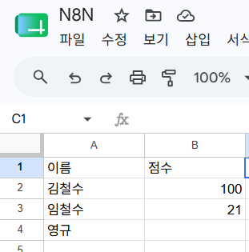 | 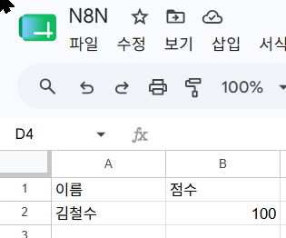 | 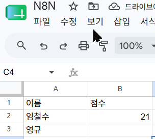 |

- 50점 이상인 데이터는 합격 시트에 기록되었습니다.
- 50점 미만인 데이터는 불합격 시트에 기록되었습니다.
- 점수가 없는 데이터는 Switch의 오류 경로로 전달되었습니다.

#### Discord 실행 결과

오류·합격·불합격 메시지가 Discord 채널에 전달되었습니다.

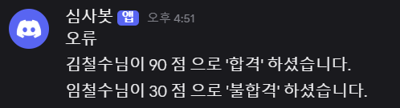

### 분기 실행 확인

| 도구 | 오류 경로 | 합격 경로 | 불합격 경로 | 결과 |
| --- | --- | --- | --- | --- |
| Make | 1회 | 1회 | 1회 | 모든 모듈 정상 완료 |
| n8n | 1건 | 1건 | 1건 | 모든 노드 정상 완료 |

## Make와 n8n 비교 분석

비용과 무료 범위는 **2026년 7월 17일** 공식 안내를 기준으로 작성했습니다. 서비스 정책은 이후 변경될 수 있습니다.

| 비교 항목 | Make | n8n |
| --- | --- | --- |
| UI/UX | 원형 모듈과 연결선을 이용한 시각적 Scenario 편집이 직관적입니다. | 노드 기반 편집 화면에서 입력·출력 item 수와 데이터 흐름을 함께 확인하기 쉽습니다. |
| 초기 설정 난이도 | 클라우드 서비스라 가입 후 바로 시작할 수 있어 비교적 쉽습니다. | 자가 호스팅은 Docker와 로컬 실행 환경을 직접 준비해야 합니다. |
| 연동 서비스 | 공식 가격 안내 기준 3,000개 이상의 앱을 제공해 SaaS 연결에 유리합니다. | 기본 노드 외에도 HTTP Request, Code, 커뮤니티·커스텀 노드로 확장할 수 있습니다. |
| 무료 사용 범위 | Free 플랜은 월 1,000 credits, 활성 Scenario 2개, 최소 예약 간격 15분을 제공합니다. | 표준 Community Edition을 직접 호스팅할 수 있으며, 서버·전기·운영 비용은 사용자가 부담합니다. |
| 실행 비용 단위 | 검색·생성·수정 등 실행된 모듈 Action에 따라 credit을 소비합니다. | n8n Cloud는 실행량 기준 플랜이고, 로컬 Community Edition은 자신의 장비 자원을 사용합니다. |
| 조건 분기 | Router와 경로별 Filter를 이용해 분기를 시각적으로 구성합니다. | Switch, If, Merge와 표현식을 조합해 복잡한 분기를 만들 수 있습니다. |
| 실행 로그 | Scenario 실행 기록에서 모듈별 입력·출력 bundle을 확인합니다. | Executions 화면에서 실행 시간, 성공 여부, 노드별 item과 입출력 데이터를 확인합니다. |
| 커스터마이징 | 기본 커넥터 중심 구성은 빠르지만 복잡한 맞춤 로직은 제약을 받을 수 있습니다. | JavaScript/Python Code 노드, HTTP API, 커스텀 노드를 활용한 세밀한 변경에 유리합니다. |
| 보안·데이터 통제 | Make가 호스팅하는 클라우드에서 연결과 실행 데이터를 관리합니다. | 자가 호스팅하면 실행 데이터와 자격증명의 저장 위치 및 접근 범위를 직접 통제할 수 있습니다. |
| 운영 부담 | 서버 설치·업데이트를 서비스 제공자가 담당합니다. | 설치, 업데이트, 백업, 접근 통제와 장애 대응을 사용자가 담당해야 합니다. |

공식 안내: [Make 요금제](https://www.make.com/en/pricing), [Make Router](https://help.make.com/router), [n8n 요금제와 Community Edition](https://n8n.io/pricing/), [n8n Docker 설치](https://docs.n8n.io/hosting/installation/docker/)

### Make의 장단점

**장점**

- 별도 서버 없이 빠르게 시작할 수 있습니다.
- 연결 상태와 분기 구조가 시각적으로 명확합니다.
- 다양한 SaaS 커넥터를 기본 제공합니다.

**단점**

- 무료 플랜의 credit과 실행 간격 제한을 고려해야 합니다.
- 실행량이 증가하면 credit 사용량과 비용도 증가할 수 있습니다.
- 호스팅 위치와 데이터 운영을 사용자가 직접 통제하기 어렵습니다.

**적합한 상황:** 서버 운영 없이 빠르게 업무 자동화를 만들거나, 이미 지원되는 SaaS를 중심으로 간단한 Scenario를 구성할 때 적합합니다.

### n8n의 장단점

**장점**

- 자가 호스팅을 통해 데이터와 자격증명 저장 환경을 직접 관리할 수 있습니다.
- Code, HTTP Request, 표현식과 커스텀 노드로 세밀한 로직을 구현하기 쉽습니다.
- 실행별 노드 데이터와 item 흐름을 상세히 확인할 수 있습니다.

**단점**

- 로컬 또는 서버 설치와 업데이트가 필요합니다.
- 백업, 보안 패치, 장애 대응을 직접 수행해야 합니다.
- 처음 사용하는 경우 자격증명과 노드 데이터 구조에 대한 학습이 필요합니다.

**적합한 상황:** API 키와 실행 데이터를 자체 환경에서 관리해야 하거나, 기본 커넥터만으로 해결하기 어려운 맞춤 로직이 필요한 경우에 적합합니다.

---

## 프로젝트 2 — 15분 자동 점수 분류 및 알림

### 반복 업무 정의

지원자 점수가 입력된 Google Sheets를 사람이 반복해서 열어 합격 여부를 판단하고, 결과 시트에 옮긴 뒤 Discord에 공유하는 업무를 자동화했습니다. 수작업으로 처리하면 누락, 잘못된 분류, 중복 기록이 발생할 수 있으므로 n8n이 15분마다 새 데이터를 확인하도록 구성했습니다.

### n8n 선정 이유

프로젝트 2에서는 다음 두 가지 이유로 n8n을 선택했습니다.

1. **보안과 데이터 통제:** n8n을 로컬 Docker 환경에 자가 호스팅하면 Google 및 Discord 자격증명을 공개 문서나 워크플로우 파일에 평문으로 적지 않고 로컬 n8n 자격증명 저장소에서 관리할 수 있습니다. 실행 데이터의 저장 위치도 직접 통제할 수 있습니다.
2. **커스터마이징 편의성:** Switch 표현식, `Append or Update`, Code 노드, HTTP Request와 커스텀 노드를 이용해 판정 규칙, 중복 처리, 메시지 형식을 필요에 맞게 확장하기 쉽습니다.

자가 호스팅 자체만으로 모든 보안이 자동 보장되는 것은 아닙니다. 로컬 계정, Docker 볼륨, 운영체제 접근 권한과 백업은 사용자가 안전하게 관리해야 합니다.

### 자동 실행 흐름

```text
Schedule Trigger (15분마다)
  → Google Sheets에서 지원자 행 조회
  → Switch
      ├─ 오류: 점수 없음/판정 불가
      │    └─ Discord 오류 알림
      ├─ 합격: 점수 ≥ 50
      │    └─ 합격 시트 Append or Update → Discord 합격 알림
      └─ 불합격: 점수 < 50
           └─ 불합격 시트 Append or Update → Discord 불합격 알림
```

`Append or Update`를 사용해 동일 식별값의 데이터가 이미 있으면 갱신하고, 없으면 새 행으로 추가하도록 설계했습니다. 이를 통해 예약 실행 때마다 같은 지원자가 무조건 중복 추가되는 문제를 줄였습니다. 수동 Trigger는 설정 확인과 테스트에만 사용하고, 실제 자동 실행은 활성화된 Schedule Trigger가 담당합니다.

### 구현 화면

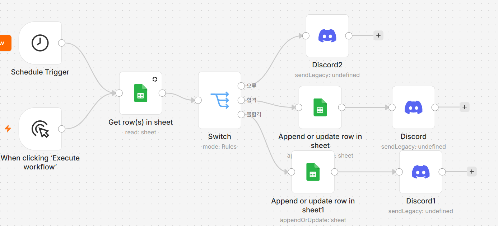

### 자동 실행 결과

Executions 화면에서 Schedule Trigger로 시작된 실행이 성공했고, 조회한 3개 item이 오류·합격·불합격 경로로 각각 1개씩 처리되었습니다. 화면 왼쪽의 실행 이력에서도 반복 실행이 성공한 것을 확인했습니다. 운영 주기는 Schedule Trigger 설정에서 15분으로 지정했습니다.

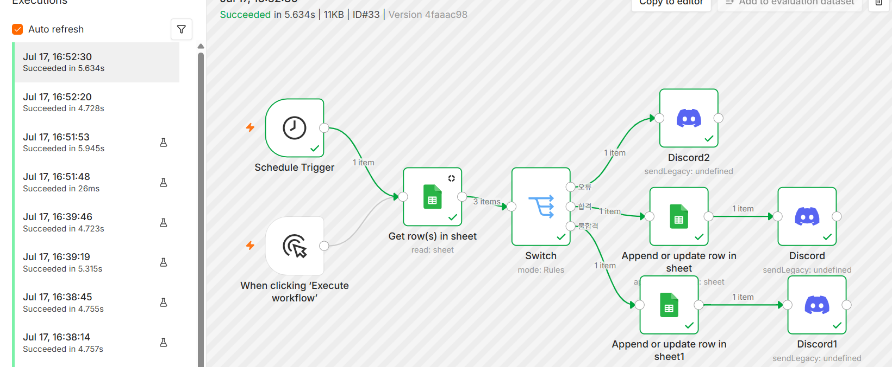

### Google Sheets 결과

| 조회한 원본 데이터 | 합격 시트 | 불합격 시트 |
| --- | --- | --- |
| 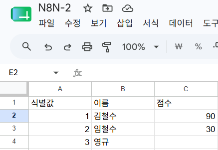 | 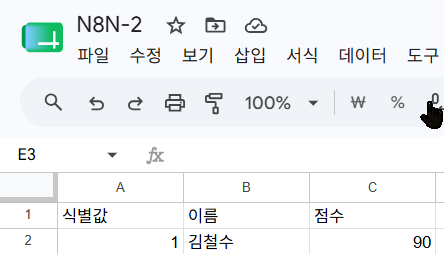 | 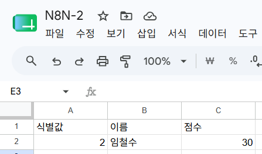 |

- 식별값 1, 김철수 90점은 합격 시트에 기록되었습니다.
- 식별값 2, 임철수 30점은 불합격 시트에 기록되었습니다.
- 식별값 3의 점수가 비어 있어 오류 경로로 처리되었습니다.

### Discord 결과

오류 메시지와 함께 김철수 90점 합격, 임철수 30점 불합격 메시지가 전송되었습니다.


---

## 보안 조치

- API 키, OAuth 토큰, 비밀번호와 Discord Webhook URL을 README 및 이미지에 노출하지 않았습니다.
- Google 및 Discord 자격증명은 로컬 n8n의 Credentials 화면에서 직접 설정합니다.
- 저장소에는 실제 비밀값을 넣지 않고 예시 환경변수 파일만 둡니다.
- 워크플로우를 공유하거나 내보내기 전에 Credential과 테스트 계정 정보가 포함되지 않았는지 확인합니다.
- 로컬 n8n은 외부에 포트를 공개하지 않고 `localhost`에서 사용합니다.

## 실행 안내 및 워크플로우 파일

로컬 n8n 실행, Google Sheets·Discord 자격증명 설정, 테스트와 관리 방법은 [로컬 n8n 실행 및 설정](docs/local-n8n.md)을 참고합니다.

워크플로우 내보내기 파일은 저장소와 분리하여 다음 이름으로 보관합니다.

- 프로젝트 1: `project1.json`
- 프로젝트 2: `project2.json`

## 결과

Make와 n8n 모두 Google Sheets 데이터 조회, 50점 기준 조건 분기, 결과 시트 기록, Discord 알림을 정상 수행했습니다. 프로젝트 2에서는 n8n Schedule Trigger를 추가하여 사람이 직접 실행하지 않아도 15분마다 판정 업무가 시작되도록 개선했습니다. 이를 통해 반복 업무의 누락을 줄이고, 결과 기록과 알림을 일관된 흐름으로 처리할 수 있습니다.
