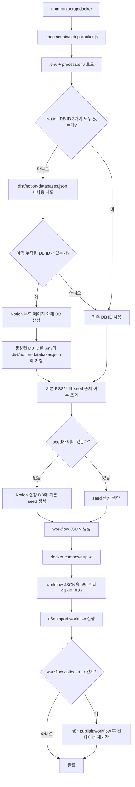
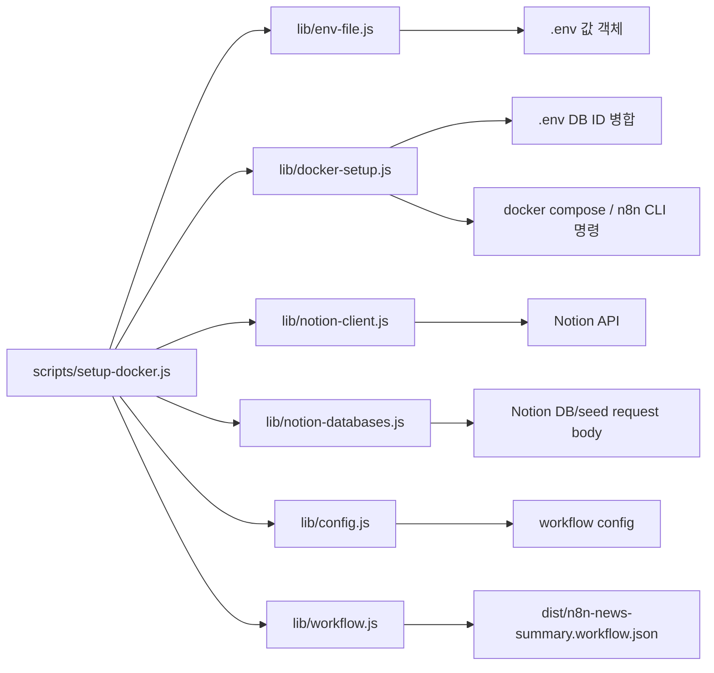
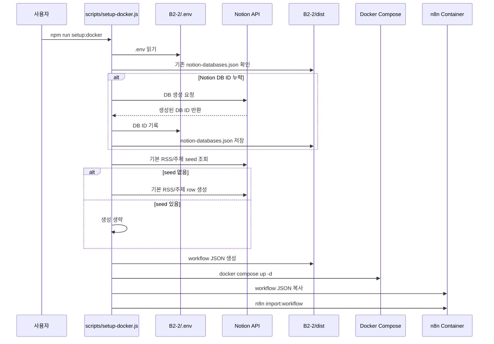

# Setup Script Flow

이 문서는 `npm run setup:docker`가 실행될 때 어떤 파일이 어떤 순서로 사용되는지 설명한다.

핵심은 `scripts/lib` 파일들이 n8n 런타임에서 직접 실행되는 코드가 아니라는 점이다. 이 모듈들은 로컬 Node.js setup 스크립트가 Notion DB를 준비하고, n8n workflow JSON을 만든 뒤, Docker 컨테이너 안의 n8n CLI로 import하기 위해 사용된다.

## 전체 구조

## setup-docker.js 실행 순서

1. `loadProjectEnv()`
   - `.env`를 읽고 현재 shell의 `process.env`를 합친다.
   - 같은 이름의 값이 있으면 `process.env`가 우선한다.

2. `createMissingDatabases(env)`
   - `NOTION_NEWS_DB_ID`, `NOTION_RSS_CONFIG_DB_ID`, `NOTION_TOPIC_CONFIG_DB_ID`가 비어 있는지 확인한다.
   - `dist/notion-databases.json`에 이전 생성 결과가 있으면 먼저 재사용해서 `.env`에 병합한다.
   - 그래도 누락된 DB가 있으면 `NOTION_API_TOKEN`, `NOTION_PARENT_PAGE_ID`로 Notion API를 호출해 DB를 만든다.
   - 생성된 DB ID는 `.env`와 `dist/notion-databases.json`에 저장한다.

3. `seedDefaultConfigRows(env)`
   - workflow 실행에 필요한 설정 DB ID와 Notion token이 있는지 검증한다.
   - RSS 설정 DB에 기본 RSS `https://api.newswire.co.kr/rss/all`이 이미 있는지 조회한다.
   - 주제 키워드 설정 DB에 기본 키워드 `AI`가 이미 있는지 조회한다.
   - 이미 있으면 생성하지 않고, 없을 때만 Notion page row를 추가한다.

4. `writeWorkflow(env)`
   - 환경 변수로부터 workflow 설정을 만든다.
   - `scripts/lib/workflow.js`로 메인 뉴스 요약 workflow와 Discord Error Trigger workflow를 생성한다.
   - 두 workflow를 `dist/n8n-news-summary.workflow.json`에 저장한다.

5. Docker import 명령 실행
   - `docker compose up -d`로 n8n과 Ollama 컨테이너를 실행한다.
   - `docker compose exec -T ollama ollama pull <OLLAMA_MODEL>`로 모델을 준비한다.
   - 생성된 workflow JSON을 컨테이너의 `/tmp/b2-2-workflow.json`로 복사한다.
   - `n8n import:workflow --input=/tmp/b2-2-workflow.json`로 workflow를 import한다.
   - `N8N_ACTIVATE_WORKFLOW=true`로 생성된 workflow가 active 상태이면 `n8n publish:workflow` 실행 후 n8n을 재시작한다.
   - 완료 메시지에 production webhook 테스트용 `curl -X POST http://localhost:5678/webhook/...` 명령을 출력한다.

## scripts/lib 파일 사용처

| 파일 | setup-docker.js에서의 역할 | 주요 export | 추가 사용처 |
| --- | --- | --- | --- |
| `config.js` | `.env` 값을 workflow 설정 객체로 변환하고 필수값을 검증한다. | `loadConfigFromEnv`, `validateConfigForWorkflow`, `DEFAULT_RSS_SOURCES`, `DEFAULT_TOPIC_KEYWORDS` | `test/config.test.js`, `test/workflow.test.js` |
| `docker-setup.js` | 누락된 Notion DB ID를 판별하고, `.env` 병합 및 Docker import 명령 목록을 만든다. | `missingNotionDatabaseEnvNames`, `mergeEnvAssignments`, `buildDockerImportCommands`, `assignmentsFromCreatedDatabaseResult` | `test/docker-setup.test.js` |
| `env-file.js` | `.env` 파일을 key-value 객체로 읽는다. | `readEnvFile` | setup 전용 |
| `notion-client.js` | setup 단계에서 Notion API를 호출하는 최소 client다. | `createNotionDatabase`, `queryNotionDatabase`, `createNotionPage` | `test/notion-client.test.js` |
| `notion-databases.js` | Notion DB 생성 body와 기본 RSS/주제 seed 생성 body를 만든다. | `buildDatabaseRequests`, `buildDefaultSeedRequests`, `envSnippet` | `test/notion-databases.test.js` |
| `workflow.js` | n8n에 import할 메인 workflow와 Discord error workflow JSON을 생성한다. | `buildWorkflow`, `buildDiscordErrorWorkflow`, `buildWorkflows` | `test/workflow.test.js`, 생성 결과 `dist/n8n-news-summary.workflow.json` |

## 모듈 간 의존 흐름

## 데이터 흐름

## 실행 후 생성/갱신되는 파일

| 경로 | 언제 생성/갱신되는가 | 설명 |
| --- | --- | --- |
| `.env` | Notion DB ID가 누락되어 있거나 이전 생성 결과를 재사용할 때 | `NOTION_*_DB_ID` 값이 병합된다. 기존 값은 유지되고 같은 key만 갱신된다. |
| `dist/notion-databases.json` | setup이 Notion DB를 새로 만들 때 | 생성된 DB 이름, env 이름, ID, URL을 보관한다. |
| `dist/n8n-news-summary.workflow.json` | setup 실행 때마다 | 현재 `.env` 기준으로 생성한 n8n workflow import 파일이다. |

## n8n 런타임과 setup 코드의 경계

`scripts/lib` 코드는 workflow import 전까지만 사용된다. import가 끝난 뒤 n8n이 스케줄이나 Manual Start로 실행할 때는 `scripts/lib` 파일을 다시 읽지 않는다.

런타임에 변경 가능한 값은 아래처럼 나뉜다.

| 변경 대상 | 변경 위치 | 반영 방식 |
| --- | --- | --- |
| 실행 시간/Webhook | `.env`의 `NEWS_CRON_EXPRESSION`, `NEWS_TIMEZONE`, `NEWS_WEBHOOK_PATH` | workflow 재생성/import 필요 |
| RSS 목록 | Notion `B2-2 RSS Sources` DB | 다음 workflow 실행부터 반영 |
| 주제 키워드 | Notion `B2-2 Topic Keywords` DB | 다음 workflow 실행부터 반영 |
| Ollama URL/모델 | `.env`의 `OLLAMA_BASE_URL`, `OLLAMA_MODEL` | workflow 재생성/import 필요 |
| Discord webhook | `.env`의 `DISCORD_WEBHOOK_URL` | workflow 재생성/import 필요 |
