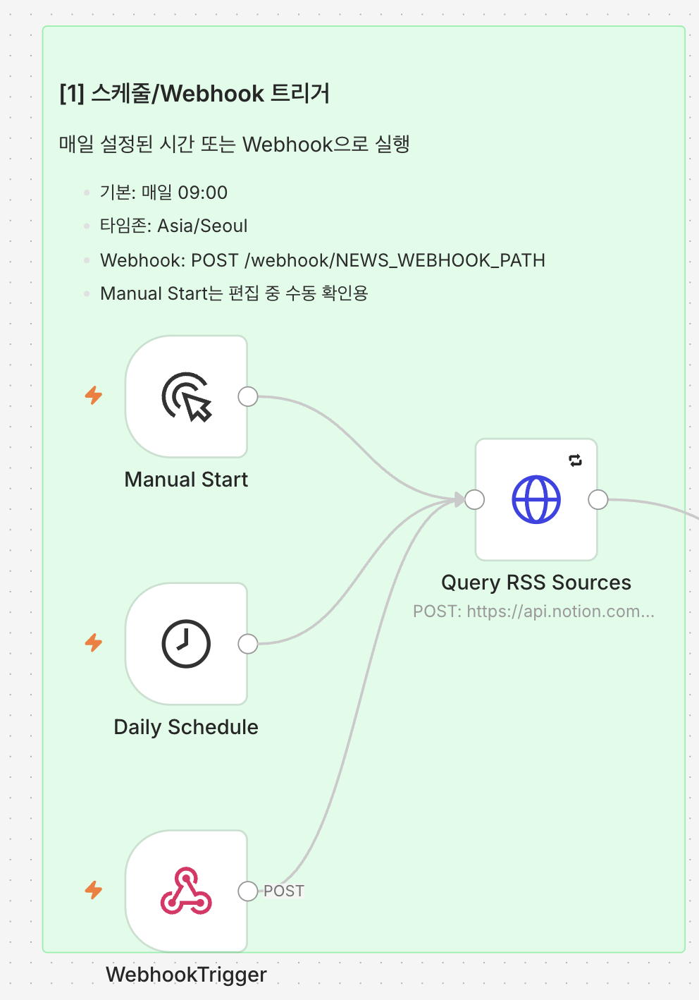
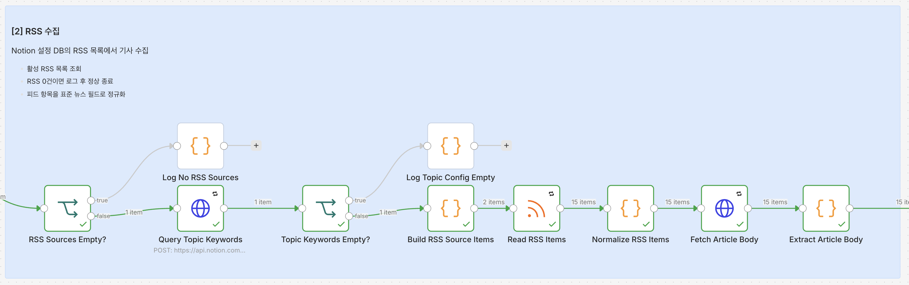
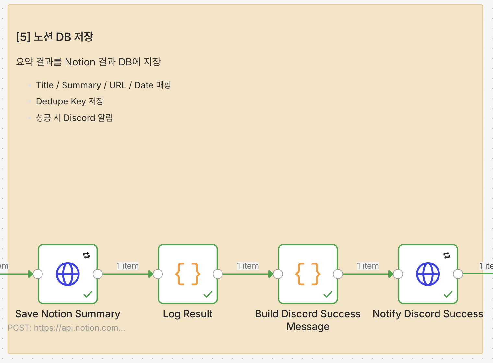
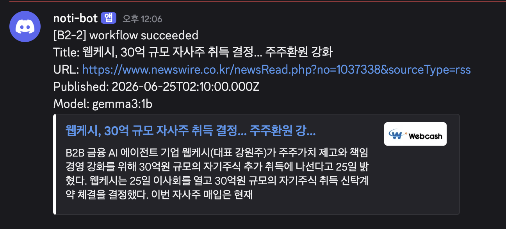
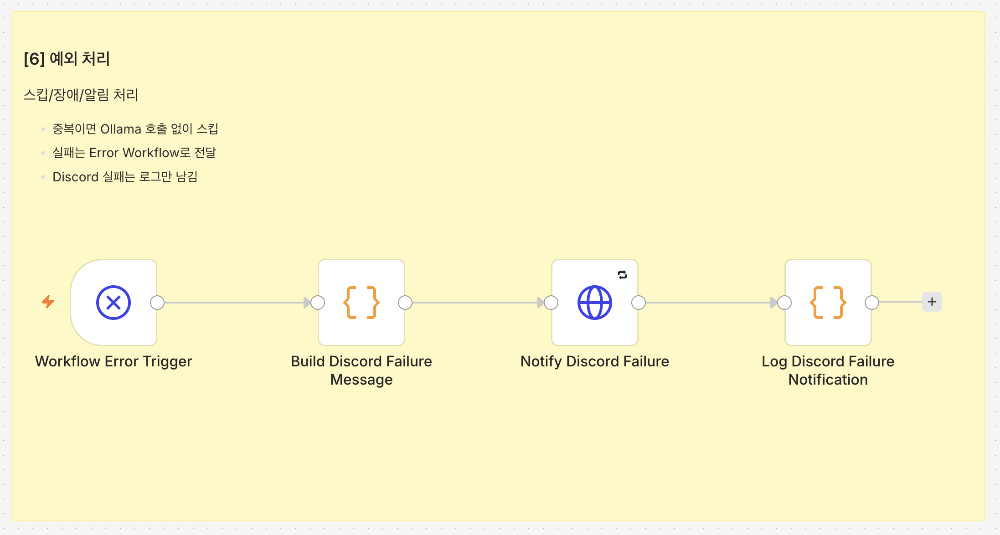

# n8n 워크플로우 설계

## 전체 흐름

메인 workflow 캔버스는 과제 예시 흐름에 맞춰 Sticky Note로 아래 6개 섹션을 시각적으로 구분한다.

```text
[1] 스케줄/Webhook 트리거
    - Manual Start / Daily Schedule / Webhook Trigger
        ↓
[2] RSS 수집
    - RSS 설정 조회, 피드 읽기, 원문 본문 조회, 기사 정규화
        ↓
[3] 주제 필터링
    - 키워드 조회, 매칭, 최신 1건 선택
        ↓
[4] AI 요약
    - 중복 확인 후 Ollama 3줄 요약
        ↓
[5] 노션 DB 저장
    - Title/Summary/URL/Date/Dedupe Key 매핑 저장
        ↓
[6] 예외 처리
    - 스킵 로그, Discord 성공 알림, Error Workflow 장애 알림
```

## 워크플로우 미리보기

아래 이미지는 n8n 캔버스를 Sticky Note 기준으로 나눈 1번부터 6번까지의 구간이다.

### 1. 스케줄/Webhook 트리거



### 2. RSS 수집



### 3. 주제 필터링


### 4. AI 요약


### 5. 노션 DB 저장 및 Discord 알림




### 6. 예외 처리



```text
[0] Manual Start
    운영 경로를 수동으로 테스트
        |
[1] Schedule Trigger
    env: NEWS_CRON_EXPRESSION, NEWS_TIMEZONE
        |
[1-1] Webhook Trigger
    POST /webhook/{NEWS_WEBHOOK_PATH}
        |
[2] Query Notion RSS Sources DB
    Enabled = true 인 RSS 목록 조회
        |
        +-- 0건이면: log NO_RSS_SOURCES -> End
        |
[3] Query Notion Topic Keywords DB
    Enabled = true 인 키워드 조회
        |
        +-- 0건이면: log TOPIC_CONFIG_EMPTY -> End
        |
[4] Build RSS Source Items
    Notion RSS 설정 DB 결과를 feedUrl 아이템으로 변환
        |
[5] Read RSS Items
    Notion RSS 설정 DB에서 읽은 feedUrl로 각 피드 항목 수집
        |
        +-- RSS 항목 0건이면: log NO_RSS_ITEMS -> End
        |
[6] Normalize News Items
    title, link, guid, publishedAt, content, source 추출
        |
[7] Fetch Article Body
    RSS item의 originalUrl로 원문 HTML 조회
        |
[8] Extract Article Body
    원문 HTML을 텍스트 본문으로 정리
        |
[9] Filter Candidates
    제목/원문 본문/RSS 요약에서 활성 키워드 매칭
        |
        +-- 매칭 0건이면: log NO_TOPIC_MATCH -> End
        |
[10] Select One Candidate
    발행일 최신순 1건 선택
        |
[11] Query Notion News DB
    dedupeKey 또는 originalUrl 기준 중복 조회
        |
        +-- 이미 존재하면: log DUPLICATE_SKIPPED -> End
        |
[12] HTTP Request to Ollama
    3줄 이내 한국어 요약 생성
        |
[13] Validate Summary
    빈 응답, 3줄 초과, JSON 오류 검사
        |
[14] Create Notion News Page
    제목, 요약, 링크, 발행일시, dedupeKey 저장
        |
[15] Log Success
    SAVED_TO_NOTION execution log 기록
```

## 노드별 역할

Notion과 Discord 연동은 n8n native credential 노드보다 HTTP Request 또는 webhook 기반 구성을 우선한다.
이유는 `.env` 기반 secret 관리와 `npm run setup:docker` 재현성을 유지하기 위해서다.
자세한 기준은 [인증/credential 관리 전략](credential-strategy.md)에 정리한다.

## 실제 n8n 노드명 목록

문서의 흐름 설명과 n8n UI에서 보이는 실제 노드명을 대조할 수 있도록 전체 노드명을 그대로 적는다.

| Workflow | 순서 | n8n 노드명 | 역할 |
| --- | ---: | --- | --- |
| B2-2 RSS AI News Summary | 1 | `Manual Start` | 편집 중 수동 확인용 트리거 |
| B2-2 RSS AI News Summary | 2 | `Daily Schedule` | 매일 정해진 시간에 실행 |
| B2-2 RSS AI News Summary | 3 | `WebhookTrigger` | production 경로 수동 실행 |
| B2-2 RSS AI News Summary | 4 | `Query RSS Sources` | Notion RSS 설정 DB 조회 |
| B2-2 RSS AI News Summary | 5 | `RSS Sources Empty?` | 활성 RSS 설정 0건 여부 분기 |
| B2-2 RSS AI News Summary | 6 | `Log No RSS Sources` | RSS 설정 0건 로그 후 종료 |
| B2-2 RSS AI News Summary | 7 | `Query Topic Keywords` | Notion 주제 키워드 DB 조회 |
| B2-2 RSS AI News Summary | 8 | `Topic Keywords Empty?` | 활성 주제 키워드 0건 여부 분기 |
| B2-2 RSS AI News Summary | 9 | `Log Topic Config Empty` | 주제 설정 0건 로그 후 종료 |
| B2-2 RSS AI News Summary | 10 | `Build RSS Source Items` | RSS 설정 행을 feed URL item으로 변환 |
| B2-2 RSS AI News Summary | 11 | `Read RSS Items` | RSS feed item 수집 |
| B2-2 RSS AI News Summary | 12 | `Normalize RSS Items` | RSS item 필드 정규화 |
| B2-2 RSS AI News Summary | 13 | `Fetch Article Body` | 원문 URL HTML 조회 |
| B2-2 RSS AI News Summary | 14 | `Extract Article Body` | HTML에서 본문 텍스트 추출 |
| B2-2 RSS AI News Summary | 15 | `Filter Candidates` | 주제 키워드 매칭 기사 필터링 |
| B2-2 RSS AI News Summary | 16 | `Select Latest Candidate` | 최신 후보 1건 선택 |
| B2-2 RSS AI News Summary | 17 | `Check Notion Duplicate` | Notion 저장 전 중복 확인 |
| B2-2 RSS AI News Summary | 18 | `Skip Duplicate` | 중복 기사 저장/AI 호출 스킵 분기 |
| B2-2 RSS AI News Summary | 19 | `Restore Selected Candidate` | 중복 조회 뒤 선택 기사 데이터 복원 |
| B2-2 RSS AI News Summary | 20 | `Summarize With Ollama` | Ollama 요약 요청 |
| B2-2 RSS AI News Summary | 21 | `Validate Summary` | 요약 결과 검증 |
| B2-2 RSS AI News Summary | 22 | `Save Notion Summary` | Notion 결과 DB 저장 |
| B2-2 RSS AI News Summary | 23 | `Log Result` | 저장 성공 로그 기록 |
| B2-2 RSS AI News Summary | 24 | `Build Discord Success Message` | Discord 성공 메시지 생성 |
| B2-2 RSS AI News Summary | 25 | `Notify Discord Success` | Discord 성공 알림 전송 |
| B2-2 Discord Error Notifier | 1 | `Workflow Error Trigger` | 메인 workflow 실패 수신 |
| B2-2 Discord Error Notifier | 2 | `Build Discord Failure Message` | Discord 실패 메시지 생성 |
| B2-2 Discord Error Notifier | 3 | `Notify Discord Failure` | Discord 장애 알림 전송 |
| B2-2 Discord Error Notifier | 4 | `Log Discord Failure Notification` | Discord 알림 실패 로그 기록 |

### 1. Schedule Trigger / Webhook Trigger

- 매일 지정 시간에 실행한다.
- 시간은 n8n 워크플로우 내부에 고정하지 않고 `NEWS_CRON_EXPRESSION` 환경변수를 사용한다.
- 타임존은 `NEWS_TIMEZONE=Asia/Seoul`을 기본값으로 둔다.
- 스케줄 변수 값을 바꾼 뒤에는 워크플로우를 다시 publish해서 Schedule Trigger가 새 값을 읽게 한다.
- Webhook Trigger는 production 실행 테스트용이다.
- Webhook path는 `NEWS_WEBHOOK_PATH` 환경변수로 관리한다.
- n8n UI의 `/webhook-test/...` URL은 Webhook 노드가 테스트 대기 중일 때만 유효하다.
- Docker 실행 후 터미널에서는 production URL인 `/webhook/...`를 사용한다.

예시:

```text
NEWS_CRON_EXPRESSION=0 9 * * *
NEWS_TIMEZONE=Asia/Seoul
NEWS_WEBHOOK_PATH=b2-2/rss-ai-news-summary/run
```

Webhook 실행 예시:

```bash
curl -X POST http://localhost:5678/webhook/b2-2/rss-ai-news-summary/run
```

### 2. Manual Start

- 수동 시작은 편집 중 빠른 확인용이다.
- Error Workflow 연동을 확인할 때는 Manual Start가 아니라 Webhook Trigger를 사용한다.
- 기본 RSS와 기본 주제 키워드 등록은 workflow 밖의 `npm run setup:docker`가 담당한다.
- 따라서 Manual Start, Daily Schedule, Webhook Trigger 모두 RSS 설정 DB가 0건이면 자동 재등록하지 않고 `NO_RSS_SOURCES` 로그 후 종료한다.

### 3. Query Notion RSS Sources DB

- RSS 목록은 워크플로우에 하드코딩하지 않는다.
- Notion RSS 설정 DB에서 `Enabled = true`인 행만 매 실행마다 조회한다.
- RSS URL이 실시간으로 추가/삭제되어도 다음 실행부터 자동 반영된다.
- 조회 결과가 0건이면 오류가 아니라 `NO_RSS_SOURCES` 로그를 남기고 정상 종료한다.

### 4. Query Notion Topic Keywords DB

- 주제 키워드는 워크플로우에 하드코딩하지 않는다.
- Notion 주제 설정 DB에서 `Enabled = true`인 키워드를 매 실행마다 조회한다.
- 활성 키워드가 0건이면 넓은 범위의 기사를 잘못 저장하지 않기 위해 `TOPIC_CONFIG_EMPTY` 로그를 남기고 종료한다.

### 5. Loop RSS Sources

- 활성 RSS URL을 Notion RSS 설정 DB 조회 결과에서 만든 뒤 RSS Feed Read 노드로 항목을 가져온다.
- 특정 RSS가 실패하면 해당 피드만 최대 2회 재시도한다.
- 재시도 후에도 실패한 피드는 `RSS_FETCH_FAILED`로 기록하고, 다른 피드는 계속 처리한다.
- 전체 RSS에서 수집된 항목이 0건이면 `NO_RSS_ITEMS` 로그를 남기고 종료한다.

### 6. Normalize News Items

- RSS마다 다른 필드명을 공통 구조로 정규화한다.
- 이 단계의 `content`는 RSS item에 포함된 요약 또는 description이며, 다음 단계에서 원문 본문으로 보강한다.

```json
{
  "title": "뉴스 제목",
  "originalUrl": "https://example.com/news/1",
  "guid": "rss-guid-or-null",
  "dedupeKey": "guid 우선, 없으면 originalUrl",
  "publishedAt": "2026-06-24T09:00:00+09:00",
  "content": "RSS 요약 또는 설명",
  "source": "RSS source name"
}
```

### 7. Fetch Article Body

- RSS item에서 얻은 `originalUrl`로 원문 기사 페이지를 HTTP GET 요청한다.
- 응답은 JSON이 아니라 HTML 텍스트로 받아 `articleHtml` 필드에 둔다.
- 실패하면 최대 2회 재시도하며, 재시도 후에도 실패하면 workflow 실패로 처리되어 Error Workflow가 Discord 장애 알림을 보낸다.

### 8. Extract Article Body

- `Fetch Article Body`의 `articleHtml`에서 script/style/comment/tag를 제거하고 사람이 읽을 수 있는 텍스트로 정리한다.
- 정리된 원문 텍스트는 `articleText`에 저장한다.
- Ollama에 전달할 `content`는 `articleText`를 우선 사용하고, 원문 텍스트가 비어 있으면 RSS 요약/description을 fallback으로 사용한다.
- 긴 본문으로 인한 Ollama 요청 과부하를 줄이기 위해 본문은 최대 12,000자로 제한한다.

### 9. Filter Candidates

- Notion 주제 설정 DB 조회 결과에서 활성 키워드를 만든다.
- 제목, 원문 본문(`articleText`), fallback 본문(`content`)을 소문자로 변환한 뒤 활성 키워드와 비교한다.
- 하나 이상의 키워드가 매칭된 기사만 후보로 남긴다.
- 후보가 없으면 `NO_TOPIC_MATCH` 로그를 남기고 종료한다.

### 10. Select One Candidate

- 과제 요구사항에 맞춰 1건만 선택한다.
- 기본 기준은 발행일시 최신순이다.
- 발행일시가 없는 경우 RSS 수집 순서를 보조 기준으로 사용한다.

### 11. Query Notion News DB

- AI 호출 전에 반드시 Notion 결과 DB를 먼저 조회한다.
- `Dedupe Key == candidate.dedupeKey` 또는 `Original URL == candidate.originalUrl` 조건으로 확인한다.
- 이미 존재하면 `DUPLICATE_SKIPPED` 로그만 남기고 종료한다.
- 이 단계가 실패하면 중복 여부를 알 수 없으므로 Ollama를 호출하지 않는다.

### 12. HTTP Request to Ollama

- 중복이 아닌 기사 1건만 Ollama로 보낸다.
- 엔드포인트는 `{{$env.OLLAMA_BASE_URL}}/api/generate`를 사용한다.
- 모델명은 `OLLAMA_MODEL` 환경변수로 관리한다.
- 최대 재시도는 `MAX_RETRY_COUNT=2`로 제한한다.
- 현재 프롬프트 버전은 `v1`이며, 변경 이력은 [prompt-history.md](prompt-history.md)에 기록한다.

프롬프트 원칙:

```text
아래 뉴스 내용을 한국어로 3줄 이내로 요약해줘.
과장하지 말고 기사에 있는 사실만 사용해.
각 줄은 하나의 핵심 내용을 담아줘.

제목: {{title}}
본문: {{content}}
```

### 13. Validate Summary

- 응답이 비어 있으면 실패로 처리한다.
- 3줄을 초과하면 앞 3줄만 저장하지 않고 `SUMMARY_INVALID`로 실패 처리한다.
- 이유: 모델이 지시를 지키지 않은 상태를 그대로 저장하지 않기 위함이다.

### 14. Create Notion News Page

- Notion 결과 DB에 뉴스 페이지를 생성한다.
- 제목, 요약문, 원문 링크, 발행일시, 중복 키를 각각 별도 속성에 저장한다.
- 저장 실패 시 최대 2회 재시도한다.

### 15. Log Success

- 저장 성공 후 n8n execution log에 `SAVED_TO_NOTION`을 기록한다.
- Discord 성공 알림을 전송한다.
- 알림에는 타이틀, 기사 원문 링크, 요약을 포함한다.
- Discord 알림 실패는 저장 성공 결과를 실패로 바꾸지 않고 로그로만 남긴다.

### 16. Notify Discord Success

- `DISCORD_WEBHOOK_URL` 환경변수로 Discord webhook에 HTTP POST를 보낸다.
- 요청 body는 `{ "content": "..." }` 형식이다.
- 알림 실패는 최대 2회 재시도하고, 그래도 실패하면 workflow 자체는 계속 성공으로 둔다.

## Error Workflow 연결

- n8n Error Trigger 워크플로우를 별도로 만든다.
- 오류 객체에서 실패 노드명, 오류 메시지, execution ID를 추출한다.
- Discord webhook으로 오류 알림을 보낸다.
- Discord 실패는 다시 오류 알림을 만들지 않고 n8n execution log에만 남긴다.
