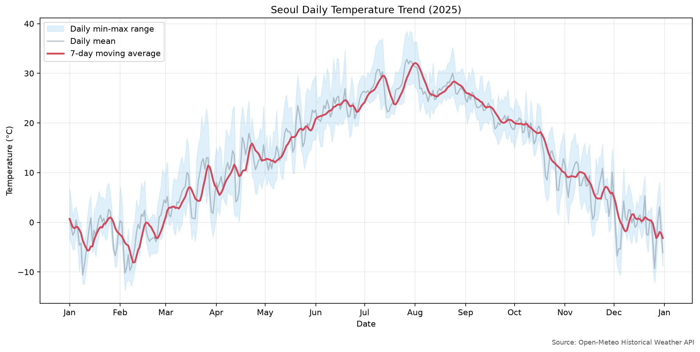
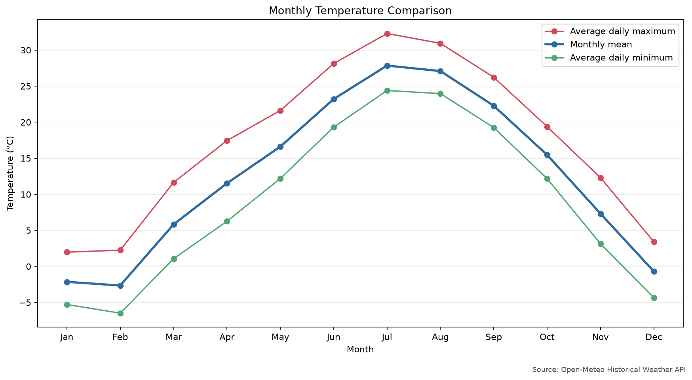
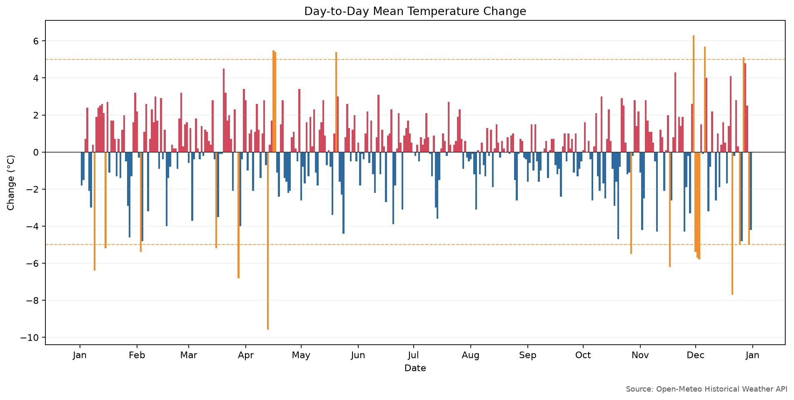
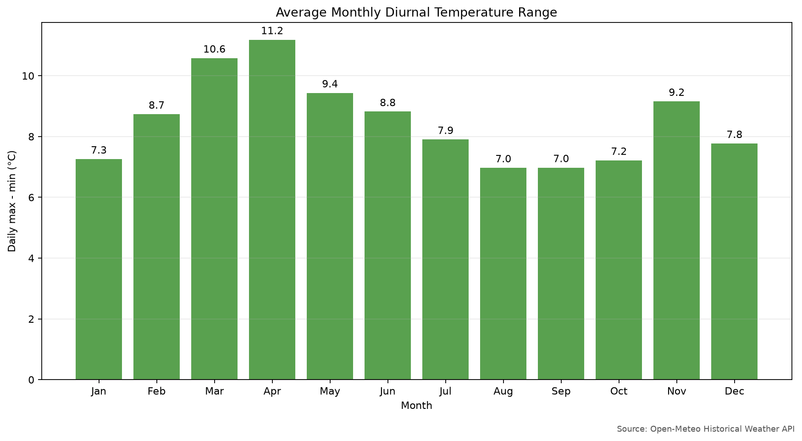

# 2025년 서울 일별 기온 변화 분석 리포트

## 1. 분석 주제 및 선정 이유

이 리포트의 **분석 주제**는 2025년 서울의 일별 평균·최고·최저기온 변화이다. 기온은 누구나 체감할 수 있고 봄·여름·가을·겨울의 흐름이 뚜렷해, 시계열의 추세·계절성·노이즈를 직관적으로 이해하기 좋다. 단순히 가장 덥거나 추운 날만 찾지 않고, 이동평균과 일별 변화량을 이용해 한 해의 흐름과 급격한 변화를 함께 살펴본다.

## 2. 분석 질문

1. 2025년 서울 기온은 한 해 동안 어떤 흐름과 계절성을 보였는가?
2. 가장 덥고 추운 날은 언제이며, 월별·계절별 평균기온 차이는 어느 정도인가?
3. 전날보다 평균기온이 가장 크게 오르거나 내린 시기는 언제인가?
4. 일교차는 월별로 어떻게 달라지는가?

## 3. 데이터 설명

- 출처: [Open-Meteo Historical Weather API](https://open-meteo.com/en/docs/historical-weather-api)
- 위치: 서울 중심부 좌표(위도 37.5665, 경도 126.9780)
- 기간: 2025-01-01 ~ 2025-12-31
- 시간대: `Asia/Seoul`
- 데이터 수: 365개(하루당 1개)
- 단위: 섭씨(°C)
- 컬럼: `date`, `temperature_mean_c`, `temperature_max_c`, `temperature_min_c`
- 저장 파일: [`data/seoul_weather_2025.csv`](data/seoul_weather_2025.csv)

Open-Meteo의 과거 날씨 자료는 기상관측소 한 곳의 원시 관측값이 아니라 ERA5 계열 등을 이용한 **격자형 재분석 자료**이다. 따라서 같은 날의 기상청 특정 관측소 값과는 차이가 날 수 있다. Open-Meteo 자료 이용 조건은 [CC BY 4.0](https://creativecommons.org/licenses/by/4.0/)이며, 이 리포트와 README에 출처를 표시했다.

## 4. 데이터 정제 및 분석 방법

### 4.1 데이터 정제

- 날짜 중복과 누락을 검사했다. 2025년 365일이 모두 있었고 중복 날짜는 없었다.
- 세 기온 컬럼의 결측치를 검사했다. 결측치는 0개였으므로 보간된 값도 0개이다.
- `최저기온 ≤ 평균기온 ≤ 최고기온` 조건을 모든 행에서 검증했다.
- IQR 기준으로 일평균기온 이상치 후보를 탐지했으나 0개였다. 극한기온은 실제 현상일 수 있으므로 이상치가 발견되더라도 자동 삭제하지 않도록 코드를 작성했다.
- 결측치가 생길 경우 연속 2일까지는 시간축 선형 보간하고, 3일 이상 연속되면 분석을 중단하도록 했다.

### 4.2 적용한 시계열 분석 기법

1. **7일 이동평균**: 하루 단위의 큰 흔들림을 줄이고 단기적인 기온 흐름을 보기 위해 사용했다.
2. **일별 변화량**: 당일 평균기온에서 전날 평균기온을 빼 급격한 상승·하락 시점을 찾았다.
3. **월별·계절별 집계**: 일별 자료를 월과 계절로 묶어 계절성을 비교했다.
4. **일교차**: 일최고기온에서 일최저기온을 빼 하루 안의 기온 변동 폭을 비교했다.

계절은 봄(3~5월), 여름(6~8월), 가을(9~11월), 겨울(12월 및 1~2월)로 구분했다.

## 5. 분석 결과 및 시각화

### 5.1 연간 기온 흐름과 7일 이동평균

일평균기온은 겨울에서 여름으로 올라간 뒤 다시 겨울로 내려오는 계절성을 보인다. 7일 이동평균의 최고치는 8월 1일 32.07°C, 최저치는 2월 9일 -8.09°C였다. 옅은 영역은 매일의 최저~최고기온 범위다.

### 5.2 월별 평균 최고·평균·최저기온

월평균기온은 2월 -2.65°C에서 7월 27.85°C까지 높아진 뒤 하락했다. 계절 평균은 겨울 -1.80°C, 봄 11.32°C, 여름 26.08°C, 가을 15.02°C였다.

### 5.3 전날 대비 평균기온 변화

주황색은 절댓값 5°C 이상의 큰 변화를 뜻한다. 가장 큰 상승은 11월 30일의 +6.3°C였고, 가장 큰 하락은 4월 13일의 -9.6°C였다. 이 그래프는 계절의 큰 흐름 안에서도 하루 사이에 단기 변동이 크게 나타날 수 있음을 보여준다.

### 5.4 월별 평균 일교차

월평균 일교차는 4월에 11.19°C로 가장 컸고, 8월에 6.97°C로 가장 작았다. 봄 평균 일교차는 10.39°C로 네 계절 중 가장 컸다.

## 6. 인사이트

### 인사이트 1: 한 해의 최고·최저 시점과 월평균의 시점은 완전히 같지 않다

- **관찰(Fact):** 일최고기온의 최댓값은 7월 29일 38.5°C였고, 일최저기온의 최솟값은 2월 4일 -13.7°C였다. 월평균기온은 7월 27.85°C로 가장 높고 2월 -2.65°C로 가장 낮았다. 두 월의 평균 차이는 30.50°C이다.
- **해석(Hypothesis):** 계절에 따른 태양에너지 차이가 연간 흐름의 기본 배경일 가능성이 높다. 다만 특정 날짜의 극값에는 기단, 구름, 바람 같은 단기 기상 조건도 영향을 줄 수 있으며, 이 데이터만으로 원인을 확정할 수 없다.

### 인사이트 2: 봄·늦가을에는 전날과 전혀 다른 기온을 경험할 수 있다

- **관찰(Fact):** 평균기온은 4월 13일 전날보다 9.6°C 내려가 연중 최대 하락을 기록했다. 반대로 11월 30일에는 전날보다 6.3°C 올라 연중 최대 상승을 기록했다. 3월 28일에도 -6.8°C, 11월 17일에도 -6.2°C의 큰 하락이 있었다.
- **해석(Hypothesis):** 봄과 늦가을은 계절이 바뀌는 경계여서 성질이 다른 공기의 영향을 번갈아 받을 가능성이 있다. 그러나 이를 검증하려면 당시의 기압계, 바람 방향, 강수 자료를 함께 확인해야 한다.

### 인사이트 3: 봄에는 낮과 밤의 기온 차이가 상대적으로 컸다

- **관찰(Fact):** 4월의 평균 일교차는 11.19°C로 12개월 중 가장 컸다. 계절별 평균도 봄 10.39°C, 겨울 7.89°C, 여름 7.89°C, 가을 7.78°C로 봄이 가장 컸다. 8월의 월평균 일교차는 6.97°C로 가장 작았다.
- **해석(Hypothesis):** 봄에는 맑고 건조한 날의 낮 가열과 야간 냉각 차이가 커질 수 있고, 여름에는 습도와 구름이 밤의 냉각을 제한할 수 있다. 이 설명은 가능한 가설이며 습도·운량·강수 자료를 추가해야 확인할 수 있다.

### 인사이트 4: 하루 값보다 이동평균이 계절 흐름을 더 안정적으로 보여준다

- **관찰(Fact):** 7일 이동평균은 2월 9일 -8.09°C로 가장 낮았고 8월 1일 32.07°C로 가장 높았다. 개별 일별 값은 큰 폭으로 오르내리지만 이동평균은 겨울→여름→겨울의 흐름을 부드럽게 보여준다.
- **해석(Hypothesis):** 의사결정 목적이 계절적 흐름 파악이라면 하루 값만 보는 것보다 이동평균을 함께 보는 편이 일시적인 잡음에 과도하게 반응할 위험을 줄일 수 있다. 반대로 한파나 급격한 변화 감지가 목적이라면 원자료와 일별 변화량을 함께 봐야 한다.

## 7. 결론

2025년 서울 기온에는 겨울에 낮고 여름에 높은 뚜렷한 계절성이 나타났다. 7월은 월평균기온이 가장 높았고 2월은 가장 낮았으며, 일별로는 38.5°C부터 -13.7°C까지 큰 범위를 보였다. 또한 계절의 완만한 흐름과 별개로 봄·늦가을에는 하루 사이 5°C 이상 변하는 시점이 있었고, 봄의 일교차가 상대적으로 컸다. 따라서 연간 흐름에는 이동평균과 월별 집계가, 급격한 변화에는 원자료와 일별 변화량이 각각 유용하다.

## 8. 한계점

- 서울 중심 좌표의 격자형 재분석 자료이므로 특정 기상관측소의 실측값과 다를 수 있다.
- 2025년 한 해만 분석했으므로 평년보다 더웠는지, 장기 기후변화가 있었는지는 판단할 수 없다.
- 기온만 사용했으므로 급변이나 일교차의 원인을 설명하는 습도, 운량, 강수, 바람, 기압 자료가 없다.
- 이동평균과 월별 평균은 전체 흐름을 잘 보여주지만 짧은 폭염·한파의 강도를 일부 완화해 보일 수 있다.
- 관찰된 동시 변화는 인과관계를 증명하지 않는다. 리포트의 원인 설명은 추가 검증이 필요한 가설이다.

## 9. AI 사용 로그

| 사용 작업 | 사용 이유 | 검증 방법 |
|---|---|---|
| 데이터 검증·전처리 코드 작성 | 날짜 누락, 결측 구간, 기온 순서 같은 오류 조건을 빠짐없이 다루기 위해 사용 | 합성 데이터로 결측 2일/3일, 중복 날짜, 잘못된 기온 순서를 자동 테스트함 |
| 이동평균·월별 집계·시각화 코드 작성 | 반복적인 계산과 네 그래프 생성을 재현 가능하게 자동화하기 위해 사용 | 계산 결과를 CSV 일부와 수작업으로 대조하고 전체 테스트를 다시 실행함 |
| 인사이트 후보와 문장 구성 | 관찰과 해석을 명확히 분리하고 대안 해석을 찾기 위해 사용 | 모든 관찰 수치를 코드 출력에서 재확인하고, 인과관계로 단정한 문장이 없는지 검토함 |
| README와 실행 절차 정리 | 다른 사람이 같은 결과를 재현하기 쉽게 만들기 위해 사용 | 새로 받지 않는 기본 실행과 `--refresh` 실행을 각각 수행하고 이미지 링크를 검사함 |

최종 주제 선택, 분석 질문, 수치의 채택, 해석의 한계와 결론은 생성된 코드와 실제 출력값을 확인한 뒤 결정했다.

