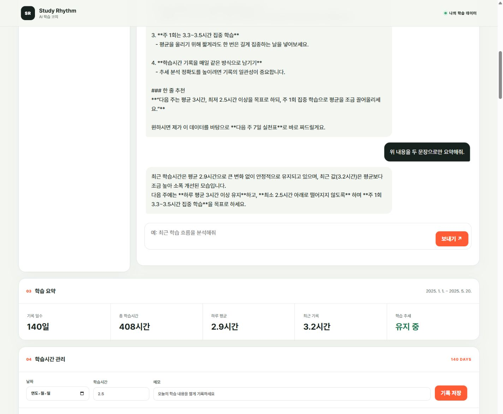
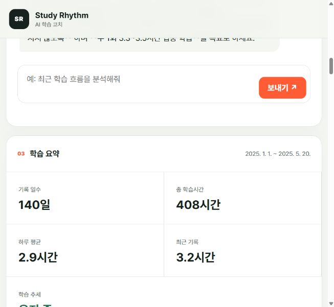
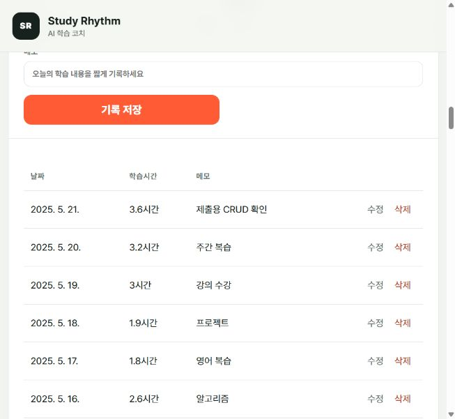
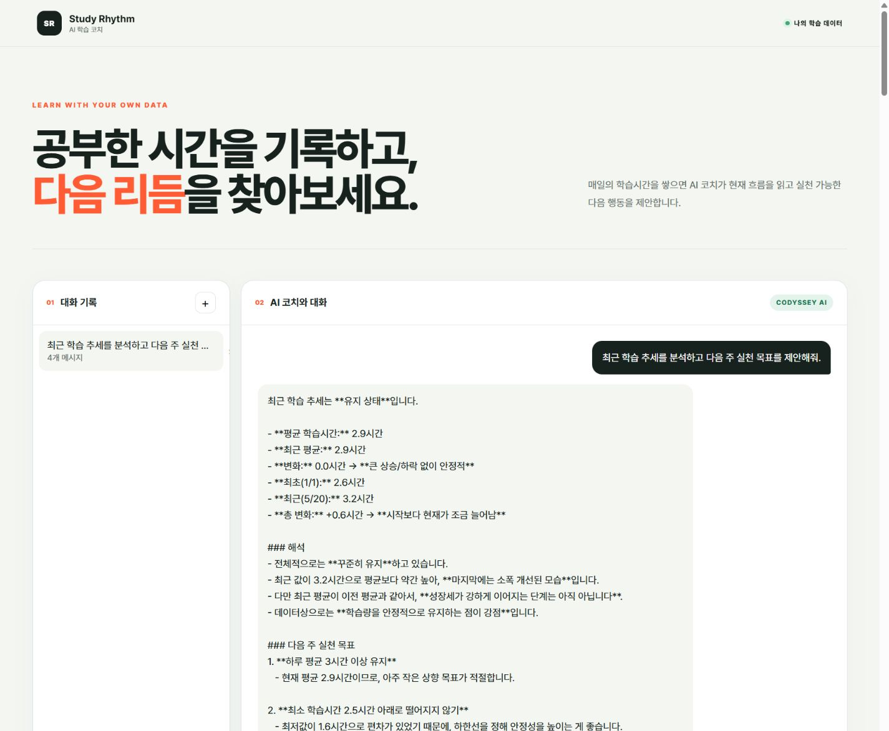
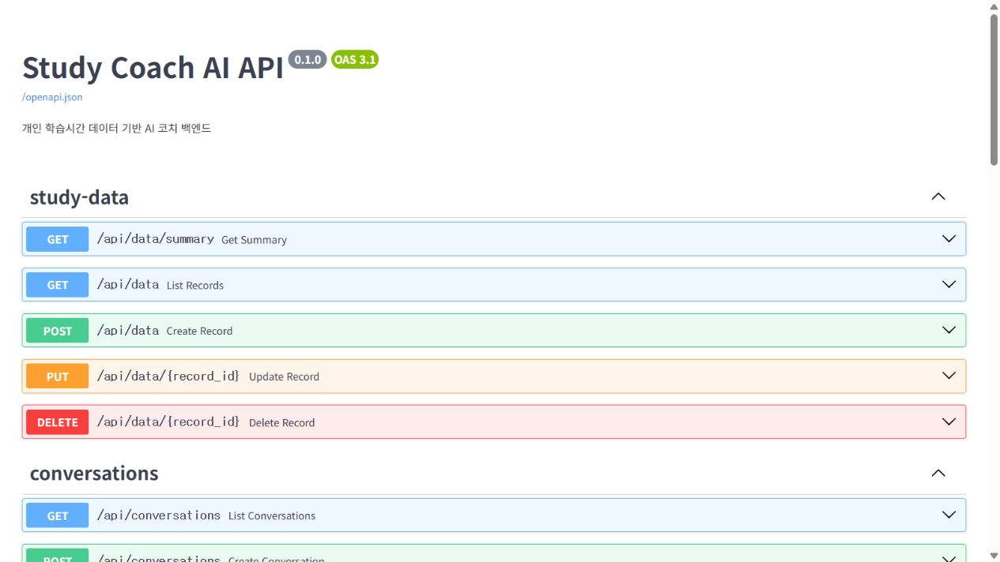
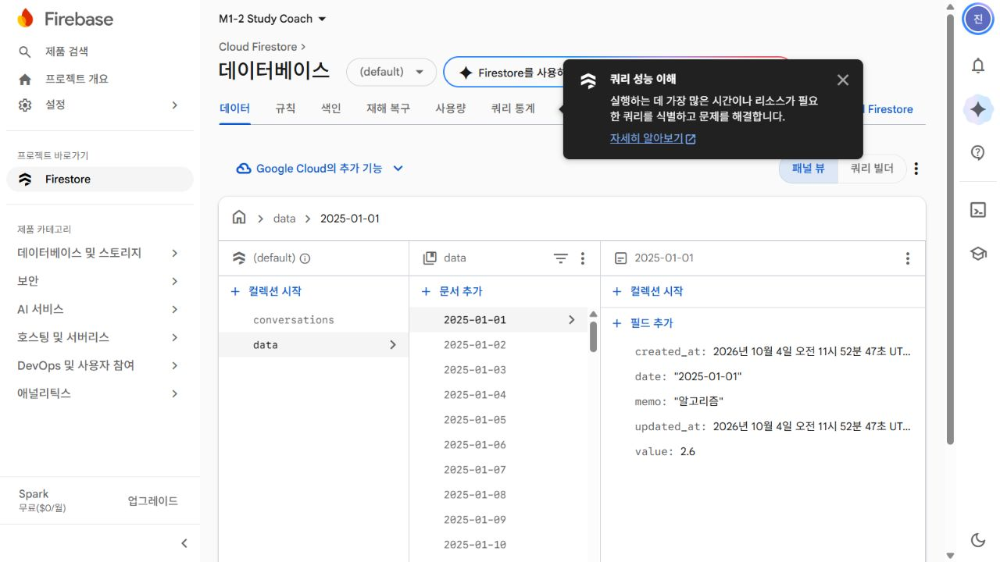
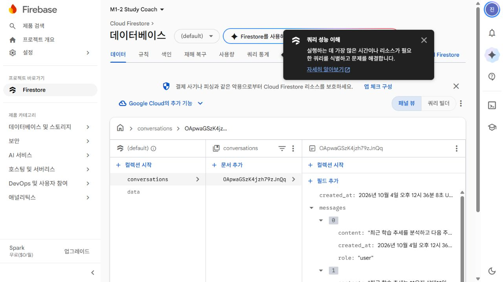

# Study Rhythm — 데이터 기반 AI 학습 코치

## 프로젝트 소개

Study Rhythm은 학습시간을 꾸준히 기록하고, 누적된 데이터에 근거해 학습 상태를 점검할 수 있도록 만든 AI 웹 서비스입니다. 분석 대상은 날짜에 따른 변화를 확인하기 쉽고 다음 학습 계획으로 연결하기 좋은 학습시간으로 정했습니다.

사용자는 날짜별 학습시간과 메모를 추가·수정·삭제할 수 있습니다. 백엔드는 저장된 기록의 기간, 합계, 평균, 최솟값, 최댓값과 최근 추세를 계산합니다. AI 코치는 이 요약을 바탕으로 답변하며, 대화 내용은 저장되므로 나중에 다시 불러와 이어서 질문할 수 있습니다.

## 서비스 주소

| 구분 | 주소 | 용도 |
| --- | --- | --- |
| 웹 서비스 | https://m1-2-study-coach.vercel.app | 사용자가 실제 기능을 이용하는 화면 |
| Swagger UI | https://m1-2-study-coach-api.onrender.com/docs | 백엔드 API 명세 확인 및 직접 실행 |
| 백엔드 기준 주소 | https://m1-2-study-coach-api.onrender.com | 프런트엔드가 API 요청을 보내는 서버 주소 |

## 전체 구조

```text
사용자
  ↓
Vercel — HTML/CSS/Vanilla JavaScript 프런트엔드
  ↓ REST API
Render — FastAPI 백엔드
  ├─ Firebase Firestore: 학습 기록과 대화 저장
  └─ Codyssey OpenAI 호환 API: AI 답변 생성
```

프런트엔드와 백엔드를 따로 배포해 화면과 데이터 처리의 책임을 분리했습니다. 브라우저에는 비밀키가 포함되지 않으며, 프런트엔드는 공개된 백엔드 주소로만 요청을 보냅니다. 데이터 저장, 통계 계산, 입력 검증과 AI 호출은 모두 FastAPI 백엔드에서 처리합니다.

## 주요 기능

아래 화면은 실제 배포 환경에서 확인한 결과입니다. 캡처에는 API 키나 Firebase 서비스 계정 같은 비밀정보를 포함하지 않았습니다.

### 데이터에 근거한 AI 답변



AI가 일반적인 조언만 생성하지 않도록 질문을 처리할 때마다 현재 학습 데이터의 요약을 함께 전달합니다. 위 답변에는 저장된 데이터에서 계산한 하루 평균 2.9시간과 최근 기록 3.2시간이 실제로 반영되어 있습니다. 같은 대화에서 후속 질문을 보내면 이전 메시지도 함께 전달하므로 문맥이 이어집니다.



기본 데이터는 2025년 1월 1일부터 5월 20일까지의 학습시간 140건입니다. 화면의 기간, 기록 일수, 총 학습시간, 하루 평균, 최근 기록과 학습 추세는 원본 기록으로부터 계산한 결과이며 고정된 문구가 아닙니다.

### 학습 기록 관리



학습 기록은 날짜, 학습시간, 메모로 구성됩니다. 화면 상단의 입력란과 각 행의 수정·삭제 버튼을 이용해 다음 네 가지 동작을 모두 수행할 수 있습니다.

| 동작 | 화면에서 확인하는 방법 | API |
| --- | --- | --- |
| 생성(Create) | 날짜·시간·메모를 입력하고 `기록 저장` 선택 | `POST /api/data` |
| 조회(Read) | 저장된 기록 목록과 학습 요약 확인 | `GET /api/data`, `GET /api/data/summary` |
| 수정(Update) | 기록 오른쪽의 `수정` 선택 후 값 변경 | `PUT /api/data/{id}` |
| 삭제(Delete) | 기록 오른쪽의 `삭제` 선택 | `DELETE /api/data/{id}` |

저장이나 변경이 끝나면 기록 목록과 요약을 다시 조회합니다. 따라서 새 기록은 목록에 즉시 나타나고, 기록 수·평균·추세도 변경된 데이터에 맞게 갱신됩니다.

### 대화 저장과 불러오기



새 상태에서 첫 질문을 보내면 사용자 메시지와 AI 답변을 묶은 대화가 자동으로 생성됩니다. 이후 질문은 같은 대화 문서의 메시지 배열에 추가합니다. 왼쪽의 대화 기록에는 제목과 메시지 수가 표시되고, 원하는 항목을 선택하면 저장된 전체 메시지를 불러와 채팅 영역에 복원합니다. 새 대화 시작과 기존 대화 삭제도 같은 화면에서 처리할 수 있습니다.

대화는 AI 응답이 정상적으로 생성된 뒤 사용자 질문과 답변을 한 쌍으로 저장합니다. 이렇게 하면 답변 생성에 실패한 질문이 불완전한 대화로 남지 않습니다. 첫 질문일 때는 새 문서를 만들고, 불러온 대화에서 질문할 때는 기존 문서에 두 메시지를 이어 붙여 대화의 연속성을 유지합니다.

| 동작 | API |
| --- | --- |
| 대화 생성 | `POST /api/conversations` |
| 대화 목록 조회 | `GET /api/conversations` |
| 특정 대화 불러오기 | `GET /api/conversations/{id}` |
| 대화 삭제 | `DELETE /api/conversations/{id}` |
| AI 질문 및 대화 자동 저장 | `POST /api/chat` |

### API 문서



FastAPI가 생성한 Swagger UI에는 데이터 관리, 요약, 대화 관리, AI 채팅과 서버 상태 확인 API가 정리되어 있습니다. 각 항목을 펼친 뒤 `Try it out`을 선택하면 요청 형식과 응답 결과를 브라우저에서 직접 확인할 수 있습니다. 이 문서는 프런트엔드와 백엔드가 어떤 주소, HTTP 방식, 요청·응답 형식을 사용할지 공유하는 API 명세이기도 합니다.

### Firestore 저장 구조



`data` 컬렉션에는 학습 기록을 저장합니다. 날짜를 문서 ID로 사용해 같은 날짜가 중복 생성되는 것을 막고, 날짜별 기록을 바로 찾을 수 있도록 했습니다.

```text
data/{YYYY-MM-DD}
  date: 학습 날짜
  value: 학습시간
  memo: 메모
  created_at: 생성 시각
  updated_at: 수정 시각
```



`conversations` 컬렉션은 여러 메시지를 하나의 대화 단위로 관리합니다. 제목과 시각 정보가 있어 목록을 구성할 수 있고, 메시지 배열을 통해 한 번의 조회로 대화 전체를 복원할 수 있습니다.

```text
conversations/{자동 생성 ID}
  title: 첫 질문을 바탕으로 만든 제목
  messages: [{ role, content, created_at }, ...]
  created_at: 생성 시각
  updated_at: 마지막 대화 시각
```

학습 기록과 대화 기록은 성격과 조회 방식이 다르므로 별도 컬렉션으로 분리했습니다. 학습 기록은 날짜별 통계 계산에 사용하고, 대화 기록은 생성·수정 시각을 기준으로 목록을 보여주거나 특정 대화를 불러오는 데 사용합니다.

### 작은 화면 지원

화면 폭이 760px 이하가 되면 여러 열로 배치된 대시보드를 한 열로 전환합니다. 요약 카드는 두 열로 줄이고, 입력 폼과 채팅 메시지 폭도 작은 화면에 맞게 조정했습니다. 따라서 모바일이나 좁은 브라우저에서도 대화 불러오기, 채팅, 기록 관리 기능을 사용할 수 있습니다.

## 데이터 요약과 AI 연결 방식

질문 한 번이 처리되는 흐름은 다음과 같습니다.

```text
사용자 질문
  → POST /api/chat
  → 기존 대화가 있으면 이전 메시지 조회
  → /api/data/summary와 같은 요약 로직 실행
  → 요약 결과를 AI 시스템 프롬프트에 추가
  → Codyssey OpenAI 호환 API 호출
  → 사용자 질문과 AI 답변을 conversations에 저장
  → 답변 및 갱신된 대화 목록을 화면에 표시
```

이 프로젝트에서는 모델을 별도로 학습시키는 대신 요청 시점의 데이터를 시스템 프롬프트에 넣는 컨텍스트 주입 방식을 사용했습니다. 데이터가 바뀌면 다음 질문부터 최신 상태가 바로 반영되고, 모델 재학습이 필요 없다는 장점이 있습니다. 반면 전달할 데이터가 많아질수록 토큰 사용량이 증가하고, 지나치게 긴 원본 데이터는 중요한 정보를 흐릴 수 있습니다. 그래서 140건의 원본을 그대로 보내지 않고 계산된 요약만 전달하며, 프롬프트에는 없는 사실을 만들지 말고 데이터가 부족하면 이를 밝히도록 지시했습니다.

`GET /api/data/summary`를 채팅 API 내부에만 넣지 않고 독립된 API로 둔 이유도 여기에 있습니다. 통계 계산의 책임을 AI 호출과 분리하면 같은 결과를 화면의 학습 요약에도 재사용할 수 있고, AI 제공자를 변경하더라도 요약 로직은 그대로 유지할 수 있습니다. 통계만 별도로 시험하거나 다른 화면에서 활용하기도 쉬워집니다.

요약은 날짜순으로 정렬한 기록에서 기간, 개수, 합계, 평균, 최솟값, 최댓값, 최초·최근 값과 전체 변화를 계산합니다. 추세는 최근 10개 평균과 바로 이전 10개 평균의 차이를 비교하고, 차이가 0.2시간 이내이면 `유지`, 더 크면 `증가`, 더 작으면 `감소`로 판정합니다. 기록이 20개보다 적을 때는 무리하게 추세를 만들지 않고 `insufficient_data`로 응답합니다.

## 백엔드 설계

FastAPI 코드는 변경 이유가 서로 다른 부분을 다음과 같이 나눴습니다.

| 구성 | 책임 |
| --- | --- |
| `routers` | URL, HTTP 방식, 요청 수신과 응답 코드 처리 |
| `schemas` | Pydantic 요청·응답 형식과 입력 검증 규칙 |
| `services` | 데이터 요약, 채팅, 대화 저장 같은 업무 규칙 |
| `repositories` | Firestore 문서 조회·생성·수정·삭제 |
| `clients` | Codyssey AI 같은 외부 API 호출 |

예를 들어 추세 기준을 바꿀 때는 `summary_service.py`, 저장소를 바꿀 때는 repository, AI 제공자를 바꿀 때는 client를 중심으로 수정할 수 있습니다. 라우터가 통계 계산이나 Firestore 세부 구현까지 직접 담당하지 않으므로 각 영역의 변경이 다른 코드로 퍼지는 것을 줄였습니다.

### 요청·응답 스키마와 검증

API에 들어오는 값은 Pydantic 스키마에서 먼저 검증합니다. 학습 기록은 미래 날짜를 허용하지 않고, 학습시간은 0시간 초과 24시간 이하, 메모는 최대 200자로 제한했습니다. 채팅 메시지는 공백을 정리한 뒤 1자 이상 4,000자 이하로 받고, 대화 제목은 최대 60자, 한 대화 생성 요청의 메시지는 최대 100개로 제한합니다. 정의하지 않은 추가 필드도 거부합니다.

응답 역시 `DataRecord`, `DataSummary`, `Conversation`, `ChatResult`처럼 용도별 스키마를 사용합니다. 덕분에 Swagger UI에 실제 데이터 구조가 문서화되고, 서비스나 저장소에서 예상과 다른 형태가 반환되는 문제도 API 경계에서 확인할 수 있습니다.

오류는 원인에 맞게 구분했습니다.

| 상태 코드 | 의미 |
| --- | --- |
| `422` | 날짜·범위·길이 등 입력값 검증 실패 |
| `409` | 같은 날짜의 학습 기록이 이미 존재함 |
| `404` | 요청한 기록이나 대화를 찾을 수 없음 |
| `503` | Firestore 연결 또는 저장 처리 실패 |
| `502` | 외부 AI 제공자 호출 실패 |

사용자 입력을 그대로 저장하거나 AI에 전달하면 지나치게 긴 값, 잘못된 수치, 예상하지 않은 필드로 데이터가 오염될 수 있고 악성 문장이 AI의 지시 체계를 흔들 수도 있습니다. 현재는 프런트엔드와 Pydantic 양쪽의 길이·범위·형식 검증, 허용된 역할만 받는 규칙, 추가 필드 거부, 비밀정보를 프롬프트에 넣지 않는 방식으로 최소 대응했습니다. 실제 사용자 계정을 받는 서비스로 확장한다면 백엔드 인증·권한 검사, 요청 횟수 제한과 유해 입력 필터를 추가하고, 브라우저가 Firestore에 직접 접근하는 구조라면 Firebase Security Rules도 함께 설정해야 합니다.

## 프런트엔드 상태 흐름

프런트엔드는 하나의 상태 저장소에서 `records`, `summary`, `conversations`, `activeConversationId`, `messages`, `loading`, `error`를 관리합니다.

- 처음 접속하면 데이터 목록·요약과 대화 목록을 동시에 불러옵니다.
- 기록을 추가·수정·삭제하면 처리 중 버튼을 잠그고, 완료 후 목록과 요약을 다시 조회합니다.
- 대화 목록에서 항목을 선택하면 해당 ID의 메시지를 불러와 활성 대화로 지정합니다.
- 질문을 보내면 사용자 메시지를 먼저 화면에 표시하고 버튼을 잠근 뒤, 응답이 오면 AI 메시지와 대화 ID를 상태에 반영합니다.
- 요청에 실패하면 임시로 바꾼 화면 상태를 이전 값으로 되돌리고 오류 문구를 표시합니다.

이 흐름을 통해 데이터 관리, 요약, 대화 불러오기와 채팅 화면이 서로 독립적으로 보이면서도 같은 최신 상태를 공유합니다.

## 배포 환경에서의 처리

### 콜드 스타트

Render의 무료 서버는 일정 시간 요청이 없으면 잠들 수 있어 첫 접속이 늦어질 수 있습니다. 채팅 요청 중에는 버튼을 비활성화하고 `답변을 만들고 있어요`를 표시하며, 8초가 지나면 무료 서버가 시작 중이고 최대 1분 정도 걸릴 수 있다는 문구로 바꿉니다. 초기 데이터 조회가 지연되거나 실패한 경우에도 화면의 상태 영역에서 첫 연결이 오래 걸릴 수 있음을 안내합니다.

### CORS

웹 화면은 Vercel 도메인에서, API는 Render 도메인에서 실행되므로 브라우저 입장에서는 서로 다른 출처입니다. 백엔드의 CORS 설정에서 `ALLOWED_ORIGINS`에 실제 Vercel 배포 주소를 지정해 해당 화면의 요청만 허용했습니다. 로컬 개발 시에는 이 변수에 로컬 프런트엔드 주소를 추가합니다. 모든 출처를 무조건 허용하지 않아 운영 환경의 접근 범위를 명확히 했습니다.

### 환경변수와 비밀정보

개발 환경과 배포 환경의 주소가 다르고 API 키는 코드에 공개되면 안 되므로 설정값을 환경변수로 분리했습니다. Codyssey AI 키, 모델, Firebase 서비스 계정 경로와 허용 출처는 백엔드 환경변수로 관리합니다. Firebase 서비스 계정 JSON은 Render Secret File에 저장하며 Git에는 커밋하지 않습니다. 프런트엔드에는 공개해도 되는 `API_BASE_URL`만 빌드 시 주입합니다.

| 변수 | 위치 | 용도 |
| --- | --- | --- |
| `COPA_API_KEY` | 백엔드 | Codyssey OpenAI 호환 API 키 |
| `AI_BASE_URL` | 백엔드 | Codyssey API 기준 주소 |
| `AI_MODEL` | 백엔드 | 사용할 AI 모델 |
| `AI_MAX_OUTPUT_TOKENS` | 백엔드 | 한 답변의 출력 토큰 상한 |
| `FIREBASE_SERVICE_ACCOUNT_FILE` | 백엔드 | Firebase 서비스 계정 JSON 경로 |
| `ALLOWED_ORIGINS` | 백엔드 | 요청을 허용할 프런트엔드 주소 |
| `API_BASE_URL` | 프런트엔드 빌드 | Render 백엔드 공개 주소 |

Codyssey가 OpenAI 호환 API를 제공하므로 일반적인 `OPENAI_API_KEY` 역할을 이 프로젝트에서는 `COPA_API_KEY`가 담당합니다.

## 데이터 증가와 요약 기준 변경

현재 `SummaryService`는 전체 학습 기록을 가져와 `calculate_summary`에서 통계를 계산합니다. 데이터가 많아지면 Firestore에서 모든 문서를 읽는 방식은 읽기 비용과 응답 시간이 증가할 수 있습니다. 이 경우 repository에 기간 조건과 페이지네이션을 추가하고, 일·주·월 단위 집계 문서를 별도로 저장해 필요한 범위만 읽도록 확장할 수 있습니다.

최근 30일만 AI 답변에 반영하려면 다음 경계를 수정하면 됩니다.

1. `data_repository.py`에 시작일·종료일 조건 조회를 추가합니다.
2. `SummaryService.get_summary()`가 오늘을 기준으로 최근 30일 범위를 요청하도록 변경합니다.
3. 필요하면 `/api/data/summary?days=30`처럼 조회 기간을 API 매개변수로 노출합니다.
4. 화면과 시스템 프롬프트에 `최근 30일 기준`임을 표시해 통계의 범위를 명확히 합니다.

통계 계산이 `summary_service.py`에 모여 있으므로 평균이나 추세 기준 자체를 바꿀 때도 이 파일을 중심으로 수정할 수 있습니다. 화면과 AI가 같은 요약 서비스를 사용하기 때문에 변경된 기준도 두 기능에 일관되게 적용됩니다.

## 기술 스택

- 프런트엔드: HTML, CSS, Vanilla JavaScript, Vercel
- 백엔드: Python 3.10+, FastAPI, Uvicorn, Pydantic, Render
- 데이터베이스: Firebase Firestore, Firebase Admin SDK
- AI: Codyssey OpenAI 호환 API, OpenAI Python SDK
- 테스트: pytest, Node.js test runner

## 로컬 실행

### 백엔드

```powershell
cd m1-2/backend
python -m venv .venv
.\.venv\Scripts\Activate.ps1
pip install -r requirements.txt
Copy-Item .env.example .env
uvicorn app.main:create_app --factory --reload
```

Firebase 서비스 계정 JSON을 `backend/firebase-service-account.json`에 두고 `.env` 값을 설정합니다. 실제 키 파일은 Git에 커밋하지 않습니다.

기본 학습시간 데이터 140건은 다음 명령으로 Firestore에 입력합니다. 같은 날짜가 이미 있으면 중복 생성하지 않고 건너뜁니다.

```powershell
python scripts/import_csv.py data/study_hours.csv
```

### 프런트엔드

```powershell
cd m1-2/frontend
npm install
$env:API_BASE_URL="http://localhost:8000"
npm run build
python -m http.server 5173 -d dist
```

브라우저에서 `http://localhost:5173`에 접속합니다. 로컬 프런트엔드 주소는 백엔드의 `ALLOWED_ORIGINS`에도 등록해야 합니다.
